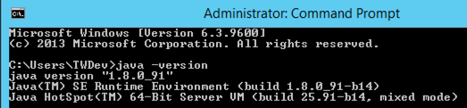
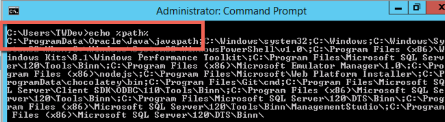

# 3.0.1 Pre-requisities

To avoid hours of troubleshooting later, it’s best to validate the install & configuration thus far.

* **JAVA SE**: Validate the installation of JavaSE by running the following command on the commandline.

  

* **JAVA Environment Variable**: Validate that the system environment variable has been updated with the java install location.

  

