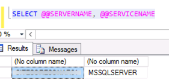
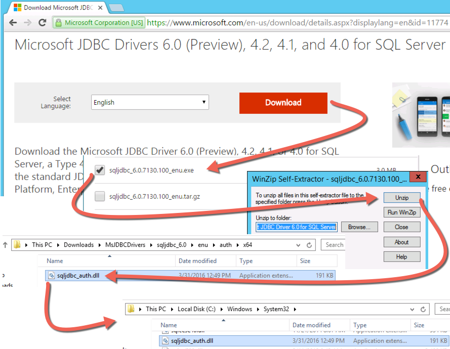
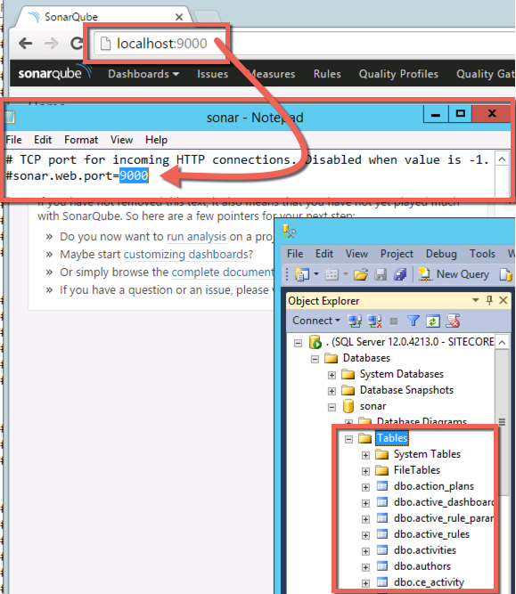

# 3.1 SonarQube - SQL Server configuration

**SQL Setup**: Validate the SQL install. Open SSMS and connect to the sql server instance - .\MSSQLServer

```text
select @@version
```


* Validate the SQL Instance & Service name

```text
select@@servername,@@servicename
```



* **Database**: Create a new database ‘sonar’ \(all lowercase\)

  > This database collation needs to be Case Sensitive \(CS\) & Accent Sensitive \(AS\) - choose Latin1\_General\_CS\_AS.

  

  The collation can be checked by running the following t-sql

```text
SELECTCONVERT(varchar,SERVERPROPERTY('collation'));
```


Warning! SQL Server 14 Express, SQL Server Management Studio, and SQL 2014 LocalDB are separate downloads, make sure you actually installed SQL Server and not just the Management Studio! [http://www.microsoft.com/en-us/download/details.aspx?id=42299](http://www.microsoft.com/en-us/download/details.aspx?id=42299)

* **SonarQube Service User**: Create a new windows user ‘SonarUser’. Give this user approprite permissions to the machine. Set this user up for access in the newly created database instance. Run the following command to check the permissions this user has in the database instance. Create a login for this user and permission this user with appropriate permission on the newly created sonar database to be able to create the schema.
* **Static Port**: In the default configuration of SQL Server, Dynamic port are enabled. SonarQube expects a static port to route the requests. Log into SQL Server configuration manager and follow the instructions here to enable the TCP/IP and disable dynamic ports. [https://msdn.microsoft.com/en-GB/library/ms177440.aspx](https://msdn.microsoft.com/en-GB/library/ms177440.aspx)

  > At this point we have all the pre-requisites installed & successfully configured. If any of the configuration validations have failed try restarting the machine and running the validations again…

  Navigate to the earlier download location of SonarQube. Right click the zip file and choose **unblock**.

  * Unzip the file and copy the binaries to the folder C:\SonarQube\
  * Open the SonarQube properties file **sonar.properties** from the following location _C:\SonarQube\sonarqube-6.7.1\conf_.
  * In the sonar.properties file look for ‘\#—– Microsoft SQLServer 2008/2012/2014 and SQL Azure’. This needs to have the connection string for the sql server database you intend to use.
  * Update the section by adding the connection string of the database

  ```text
  # DATABASE
  #
  # IMPORTANT:
  # - The embedded H2 database is used by default. It is recommended for tests but not for
  #   production use. Supported databases are MySQL, Oracle, PostgreSQL and Microsoft SQLServer.
  # - Changes to database connection URL (sonar.jdbc.url) can affect SonarSource licensed products.

  # User credentials.
  # Permissions to create tables, indices and triggers must be granted to JDBC user.
  # The schema must be created first.
  sonar.jdbc.username=sonar
  sonar.jdbc.password=sonar

  sonar.jdbc.url=jdbc:sqlserver://localhost:<portnumber if otherthan 1433>;databaseName=sonar;integratedSecurity=true

  # WEB SERVER
  # Binding IP address. For servers with more than one IP address, this property specifies which
  # address will be used for listening on the specified ports.
  # By default, ports will be used on all IP addresses associated with the server.
  sonar.web.host=0.0.0.0

  # Web context. When set, it must start with forward slash (for example /sonarqube).
  # The default value is root context (empty value).
  sonar.web.context=/
  # TCP port for incoming HTTP connections. Default value is 9000.
  sonar.web.port=9000
  ```

  

  * For Integrated Security to work, you have to download the Microsoft SQL JDBC driver package from 

    [http://www.microsoft.com/en-us/download/details.aspx?displaylang=en&id=11774](http://www.microsoft.com/en-us/download/details.aspx?displaylang=en&id=11774)

     and copy sqljdbc\_auth.dll to your system32 folder.

  

  * Launch a command prompt as administrator. Navigate to C:\SonarQube\sonarqube-6.7.1\bin\windows-x86-64 and run the below listed command.
  * At this point you should see the SonarQube running up in a local webserver mode. Open a browser and navigate to [http://localhost:9000](http://localhost:9000). Since this is the first time, SonarQube will deploy the schema to the sonar database.

  > SonarQube uses 9000 as the default port, you can change this to another port from the sonar.properties file.

  

  > Remember to look into the log file located at C:\SonarQube\sonarqube-6.7.1\logs if you run into any exceptions. The error messages are quite well documented.

  If you accidentally left the database collation to case insensitive you are bound to hit some exceptions…

  > If the database has set up with case insensitive or there are issues with the user permissions expect to see exceptions. The best way to get to the bottom of the issue is to look at the log file available here… C:\SonarQube\sonarqube-6.7.1\logs.

