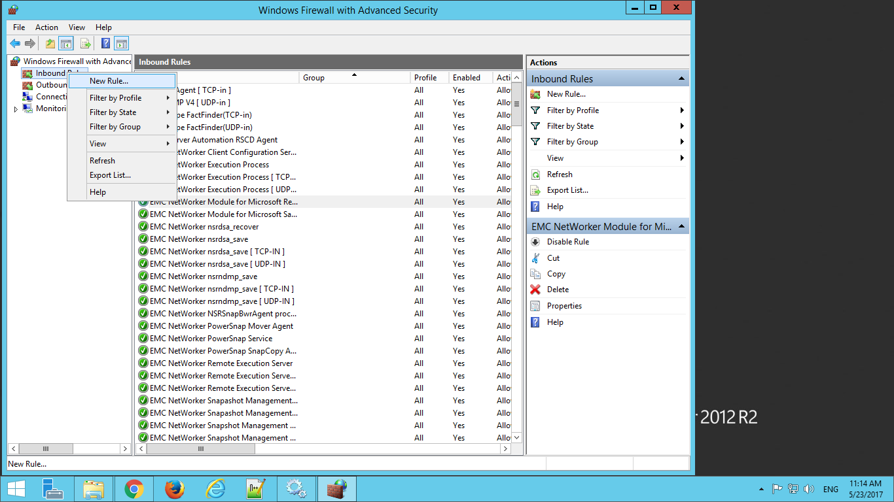
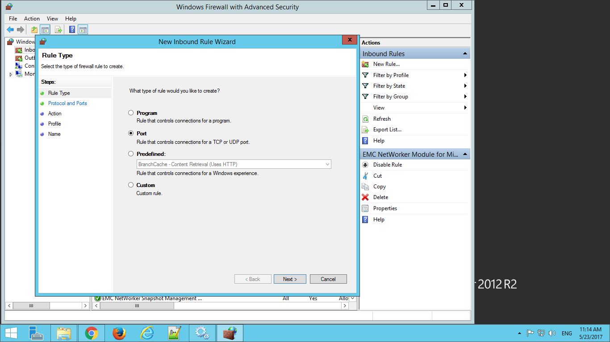
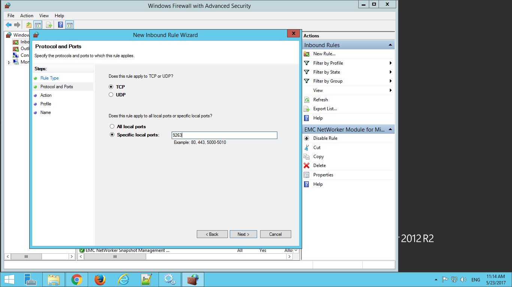
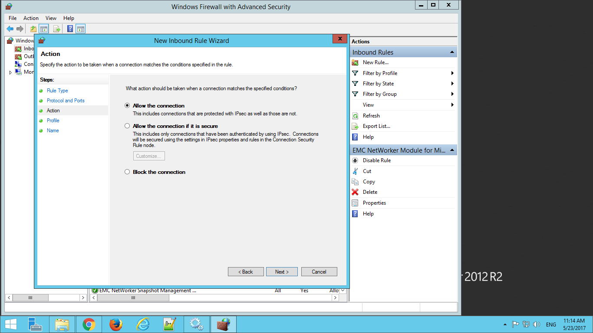
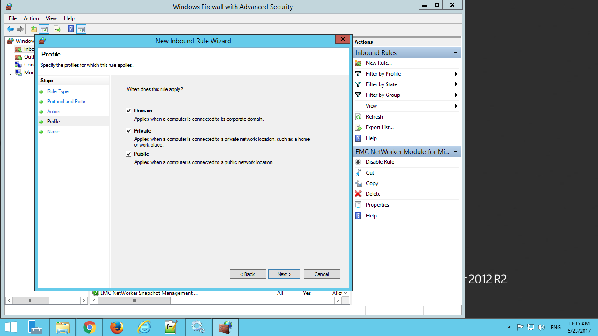
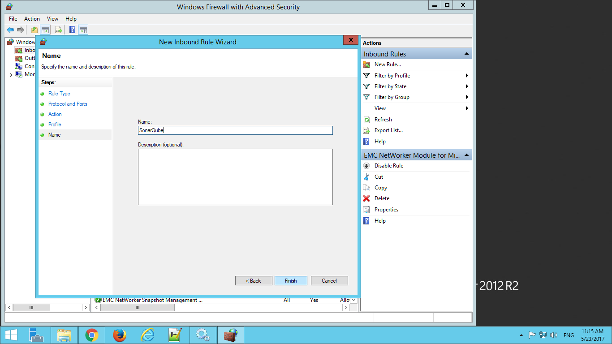

# 3.4 Firewall settings for SonarQube

If you have changed the default URL of SonarQube in _**sonar.properties under configuration folder\(conf\)of sonarQube**_ installation then comment the sonar.web host line if you want the server to visible inside the network.

```text
#sonar.web.host=0.0.0.0

# Web context. When set, it must start with forward slash (for example /sonarqube).
# The default value is root context (empty value).
sonar.web.context=/
# TCP port for incoming HTTP connections. Default value is 9000.
sonar.web.port=<to the port number you want to change>
```

Open up "Windows Firewall with Advanced Security" as an **administrator** and navigate to the inbound rules and right click to create a new rule.

The Windows firewall offers four types of rules:

* **Program**– Block or allow a program.
* **Port**– Block or a allow a port, port range, or protocol.\(select this\)
* **Predefined**– Use a predefined firewall rule included with Windows.
* **Custom**– Specify a combination of program, port, and IP address to block or allow.



On the Protocol and Ports pane, select a protocol type and specify ports. For example,specify the local port where the sonarqube is installed \(in this example i am taking the port number as 9263\)



In the Action pane, Select the “Allow the connection” option to allow the connection from the IP address and ports you specified. Be sure to check that no other firewall rules apply to the program – for example, if you have a firewall rule that allows all inbound traffic to the server application, this rule won’t do anything.

On the Profile screen, you can apply the rule to a specific profile – for example, if you only want a program blocked when you’re connected to public Wi-Fi and other insecure networks, leave the “Public” box checked. By default, Windows applies the rule to all profiles.



In Name section provide a name to the profile, in this example it is SonarQube.

The rule takes effect after you click Finish and Restart the SonarQube server for safer side.

