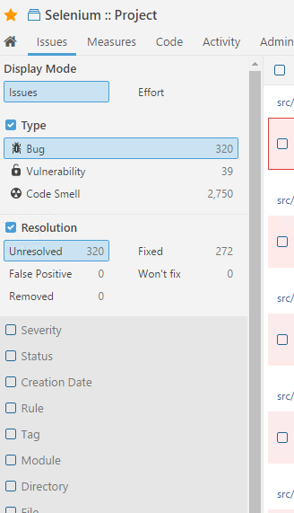

# 5.2 Advanced Analysis using SonarQube

If you want to validate the project then first you must navigate to the project folder in command prompt and hit the following command

> _sonar-scanner_

The above command requires the **sonar-project.properties** file to be available in the project location otherwise it gives error messages.

So, use the below basic code to create the sonar-project.properties file to compile the code and analyse it.

```text
## ********************************************************************* ##
##  File Name  : sonar-project.properties                     ##  
##  Description: Used to analyse the code from scripts             ##
## ********************************************************************  ##
## Author                            Version          Creation Date     ##
## ********************************************************************  ##
##  Sai Kiran Nataraja         v1.0             20-March-2016        ##
## ********************************************************************* ##

##########################################################################
######################## Required configuration ##########################
##########################################################################

#Sonar Web Login credentials
sonar.login=saikiran.nataraja
sonar.password=saikiran

sonar.projectKey=ProjectKeyName
sonar.projectName=Selenium :: Project
sonar.projectVersion=1.0
#Sonar URL
sonar.host.url=http://localhost:9263/

#Deprecated from Sonar version 5.3
##Global database settings of sonarqube
#sonar.jdbc.username=sonar
#sonar.jdbc.password=sonar

# Language
#sonar.language=java --> To trigger multi language analysis this line is commented
sonar.java.source=1.8
sonar.java.target=1.8

# Project description
sonar.projectDescription=This project is to verify and validate the Application for every release build.

# Path to source directories (Comma-separated paths to directories with sources are required)
sonar.sources=src/
# Path to Library directories (comment if no libs)
sonar.java.libraries=Libraries/

#Path for binaries
sonar.java.binaries=bin/

##########################################################################
######################## Optional configuration ##########################
##########################################################################

# Encoding of the source files
sonar.sourceEncoding=iso-8859-1

# JUnit report generated by run-sonar.sh is stored in sonar-reports/TEST-report.xml
# The XML files have to be prefixed by TEST- otherwise they are not processed 
# For Performing Unit Tests 
#sonar.dynamicAnalysis=reuseReports
#sonar.junit.reportsPath=sonar-reports/

# Project SCM settings
sonar.scm.enabled=true
# sonar.scm.url=scm:git:https://...
```

## After we get a success message in the command prompt, we can view the analysis results in the dashboard of sonarQube.


For Advanced analysis, click on the link under Bugs \(i.e 320\) to view which test scripts have the code issues.



Now select based on the file and fix the code for a greater quality product

