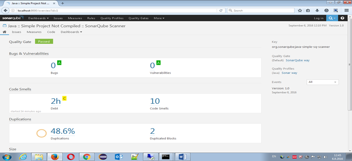
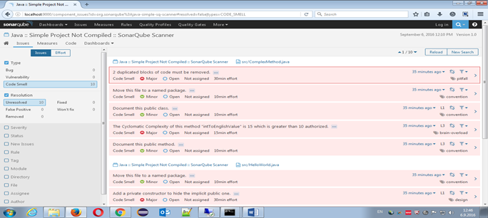

# 6. Understanding the Report

After running the batch command , you can see the report in the web console.

After logging in as administrator into the Web Console you will be able to view the code analysis.When you click on any of the respective columns like Code Smells it will display what needs to be done to change the code.

Now select the required file and fix the code for a greater quality product.

