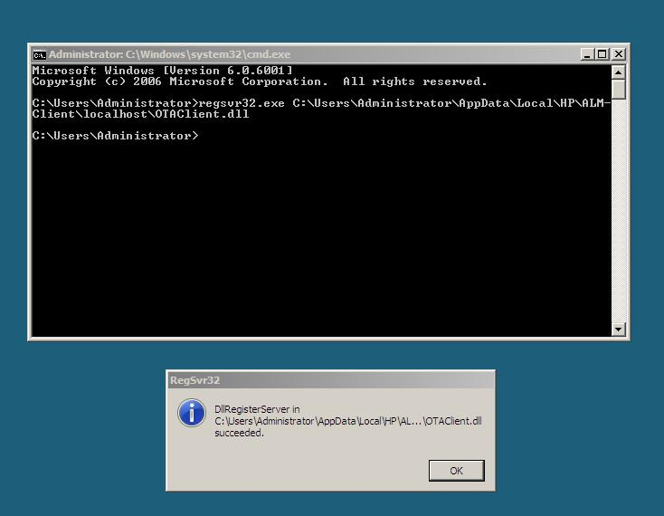

## On a 32-Bit OS: {#on-a-32-bit-os}

1) Open CMD prompt. Change your directory to C:\Windows\System32

OTAClient.dll is typically located in “C drive”C:\Users\&lt;username&gt;\AppData\Local\HP\ALM-Client\localhost\

If you are unable to see The **AppData** folder, enable viewing of Hidden files as **AppData** is a Hidden Folder.For registering the dll, use the below command as Administrator.**C:\Windows\System32&gt;regsvr32.exe C:\Users\Administrator\AppData\Local\HP\ALM-Client\localhost\OTAClient.dll**Press Enter Key, once it is done, you will get a Message as &quot;DLL Register succeeded&quot;.